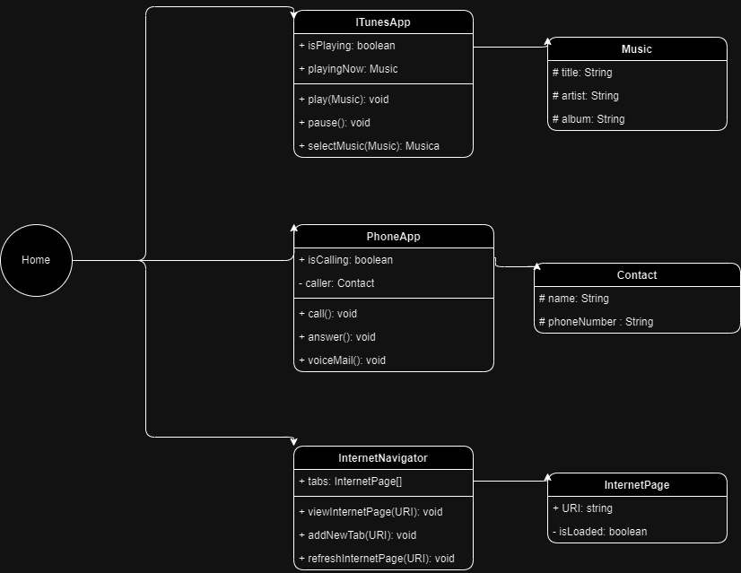

# DIO - Trilha Java Básico

<www.dio.me>

## Autor

- [GleidsonLM](https://github.com/gleidson)

## Sobre

Envio para desafio de modelagem e diagramação da representação em UML e Código no que se refere ao componente iPhone.

| ClassesDoIphone |||
| - | - | - |
| + iTunes | + Phone | + Safari |
| # play | # call | # viewInternetPage |
| # pause | # answer | # refreshInternetPage |
| # selectMusic | # voiceCall | # addNewTab |

## POO - Desafio

Com base no vídeo de lançamento do iPhone conforme link abaixo, elabore em uma ferramenta de UML de sua preferência a diagramação das classes e interfaces com a proposta de representar os papéis do iPhone de: Reprodutor Musicial,  Aparelho Telefônico e Navegador na Internet. Em seguida crie as classes e interfaces no formato de arquivos .java

[Lançamento iPhone 2007](https://www.youtube.com/watch?v=9ou608QQRq8)

- Minutos relevantes do 00:15 até 00:55
