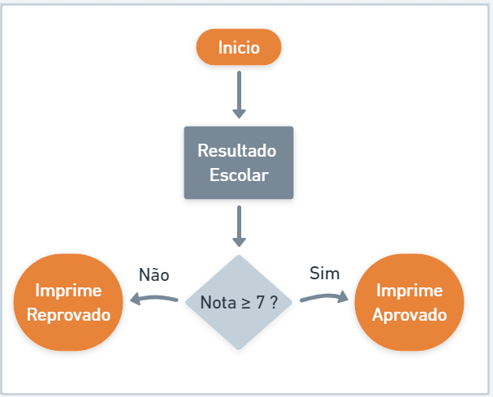

# Estruturas condicionais

A Estrutura Condicional possibilita a escolha de um grupo de ações e comportamentos a serem executadas quando determinadas condições são ou não satisfeitas. A Estrutura Condicional pode ser **Simples** ou **Composta**.

## Condicionais Simples

Quando ocorre uma validação de execução de fluxo somente quando a condição for positiva, consideramos como uma estrutura **Simples**, exemplo:

 (1).png>)

```java
// CaixaEletronico.java
public class CaixaEletronico {
    public static void main(String[] args) {

       double saldo = 25.0;
       double valorSolicitado = 17.0;

       if(valorSolicitado < saldo)
        saldo = saldo - valorSolicitado;

        System.out.println(saldo);

    }
}
```

## Condicionais Composta

Algumas vezes o nosso programa deverá seguir mais de uma jornada de execução condionado a uma regra de negócio, este cenário é demoninado **Estrutura Composto**. Vejamos o exemplo abaixo:



```java
// ResultadoEscolar.java
public class ResultadoEscolar {
    public static void main(String[] args) {

       int nota = 6;
       
       if(nota >= 7)
        System.out.println("Aprovado");

       else
        System.out.println("Reprovado");
    }
}
```


Vale ressaltar aqui que no Java um bloco **`if/else`** as vezes necessita de adicionar um bloco de **`{ }`**se a lógica conter mais de uma linha.


## Condicionais encadeadas

Em um controle de fluxo condicional, nem sempre nos limitamos ao **se** (`if`) e **senão** (`else`), poderemos ter uma terceira, quarta e ou inúmeras condições.

 (1).png>)

```java
// ResultadoEscolar.java
public class ResultadoEscolar {
    public static void main(String[] args) {
        int nota = 6;

	if (nota >= 7)
		System.out.println("Aprovado");
	else if (nota >= 5 && nota < 7)
		System.out.println("Recuperação");
	else
		System.out.println("Reprovado");
    }
}
```

## Condição ternária

Como vimos em operadores, podemos abreviar nosso algorítmico condicional refatorando com o conceito de operador ternário. Vamos refatorar os exemplos acima para ilustrar o poder deste recurso:&#x20;

```java
// Cenário 1
public class ResultadoEscolar {
	public static void main(String[] args) {
		int nota = 7;
		String resultado = nota >=7 ? "Aprovado" : "Reprovado";
		System.out.println(resultado);
	}
}
```

```java
// Cenário 2
public class ResultadoEscolar {
	public static void main(String[] args) {
		int nota = 6;
		String resultado = nota >=7 ? "Aprovado" : nota >=5 && nota <7 ? "Recuperação" : "Reprovado";
		System.out.println(resultado);
	}
}

```

## Switch Case

A estrutura **switch** compara o valor de cada caso com o da variável sequencialmente, e sempre que encontra um valor correspondente, executa o código associado ao caso. Para evitar que as comparações continuem a ser executadas após um caso correspondente ter sido encontrado, acrescentamos o comando _**break**_ no final de cada bloco de códigos. O comando **break**, quando executado, encerra a execução da estrutura onde ele se encontra.&#x20;

Vamos imaginar que precisaremos imprimir uma medida com base em mapa de valores, exemplo:

| Sigla | Tamanho |
| ----- | ------- |
| P     | PEQUENO |
| M     | MEDIO   |
| G     | GRANDE  |

```java
// SistemaMedida.java

// Modo condicional if/else
public class SistemaMedida {
	public static void main(String[] args) {
		String sigla = "M";

		if(sigla == "P")
			System.out.println("PEQUENO");
		else if(sigla == "M")
			System.out.println("MEDIO");
		else if(sigla == "G")
			System.out.println("GRANDE");
		else
			System.out.println("INDEFINIDO");
			
		
	}
}
```

```java
// SistemaMedida.java

// Modo condicional switch / case
public class SistemaMedida {
	public static void main(String[] args) {
		String sigla = "M";

		switch (sigla) {
		case "P":{
			System.out.println("PEQUENO");
			break;
		}
		case "M":{
			System.out.println("MEDIO");
			break;
		}
		case "G":{
			System.out.println("GRANDE");
			break;
		}
		default:
			System.out.println("INDEFINIDO");
		}
			
		
	}
}

```


Observe que a nível de sintaxe não tivemos nenhum ganho quanto a redução de códigos e ainda tivemos mais uma preocupação em informar a palavra `break` em cada alternativa.


Porém um cenário que poderíamos adequar o uso do switch/case para melhorar nosso algorítimo seria conforme ilustração abaixo:

Imagina que fomos requisitados a criar um sistema de plano telefônico onde:

* O sistema terá 03 planos: BASIC, MIDIA , TURBO
* BASIC: 100 minutos de ligação
* MIDIA: 100 minutos de ligação + Whats e Intagram grátis
* TURBO: 100 minutos de ligação + Whats e Intagram grátis + 5Gb Youtube

```java
// Modo condicional convencional
public class PlanoOperadora {
	public static void main(String[] args) {
		String plano = "M"; //M / T
		
		if(plano == "B") {
			System.out.println("100 minutos de ligação");
		}else if(plano == "M") {
			System.out.println("100 minutos de ligação");
			System.out.println("Whats e Intagram grátis");	
		}else if(plano == "T") {
			System.out.println("100 minutos de ligação");
			System.out.println("Whats e Intagram grátis");	
			System.out.println("5Gb Youtube");	
		}
			
		
	}
}

```

```java
// Modo condicional switch/case
public class PlanoOperadora {
	public static void main(String[] args) {
		String plano = "M"; // M / T

		switch (plano) {
			case "T": {
				System.out.println("5Gb Youtube");
			}
			case "M": {
				System.out.println("Whats e Intagram grátis");
			}
			case "B": {
				System.out.println("100 minutos de ligação");
			}
		}
	}
}
```


Se optarem por usar **`switch`** / **`case`**, estudem um  pouco mais sobre os conceitos de **`break`** e **`default`**


&#x20;


#### Referências





{% embed url="http://www.bosontreinamentos.com.br/java/estrutura-de-decisao-condicional-switch-em-java#:~:text=O%20condicional%20switch%20testa%20o,representados%20pela%20palavra%20reservada%20case.&text=A%20estrutura%20switch%20compara%20o,o%20c%C3%B3digo%20associado%20ao%20caso." %}
